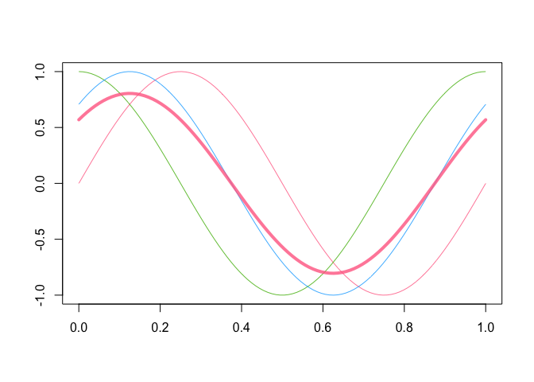
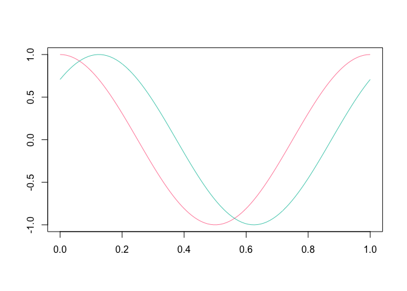

<!-- README.md is generated from README.Rmd. Please edit that file -->

# roahd <a href='https://astamm.github.io/roahd'></a>

<!-- badges: start -->

[](https://github.com/astamm/roahd/actions)
[](https://github.com/astamm/roahd/actions)
[](https://codecov.io/gh/astamm/roahd)
[](https://github.com/astamm/roahd/actions)
[](https://CRAN.R-project.org/package=roahd)
[](https://cran.r-project.org/package=roahd)
<!-- badges: end -->

The **roahd** (*Robust Analysis of High-dimensional Data*) package
allows to use a set of statistical tools for the *exploration* and
*robustification* of univariate and multivariate **functional datasets**
through the use of depth-based statistical methods.

In the implementation of functions, special attention was put to their
efficiency, so that they can be profitably used also for the analysis of
high-dimensional datasets.

For a full-featured description of the package, please take a look at
the [roahd](https://astamm.github.io/roahd/articles/roahd.html)
vignette.

## Installation

Install the released version of **roahd** from CRAN:

``` r
install.packages("roahd")
```

Or install the development version from GitHub with:

``` r
# install.packages("remotes")
remotes::install_github("astamm/roahd")
```

## [`fData`](https://astamm.github.io/roahd/reference/fData.html) and [`mfData`](https://astamm.github.io/roahd/reference/mfData.html) objects

A simple `S3` representation of functional data object,
[`fData`](https://astamm.github.io/roahd/reference/fData.html), allows
to encapsulate the important features of univariate functional datasets
(like the grid of the dependent variable, the pointwise observations,
etc.):

``` r
library(roahd)

# Grid representing the dependent variable
grid = seq( 0, 1, length.out = 100 )

# Pointwise measurements of the functional dataset
Data = matrix( c( sin( 2 * pi * grid ),
                  cos ( 2 * pi * grid ),
                  sin( 2 * pi * grid + pi / 4 ) ), ncol = 100, byrow = TRUE )

# S3 object encapsulating the univariate functional dataset            
fD = fData( grid, Data )

# S3 representation of a multivariate functional dataset
mfD = mfData( grid, list( 'comp1' = Data, 'comp2' = Data ) )
```

Also, this allows to exploit simple calls to customized functions which
simplifies the exploratory analysis:

``` r
# Algebra of fData objects
fD + 1 : 100
fD * 4

fD + fD

# Subsetting fData objects (providing other fData objects)
fD[ 1, ]
fD[ 1, 2 : 4]

# Sample mean and (depth-based) median(s)
mean( fD )
mean( fD[ 1, 10 : 20 ] )
median_fData( fD, type = 'MBD' )
```

``` r
# Plotting functions
plot( fD )
plot( mean( fD ), lwd = 4, add = TRUE )
```



``` r
plot( fD[ 2:3, ] )
```



## Robust methods for functional data analysis

A part of the package is specifically devoted to the computation of
depths and other statistical indices for functional data:

-   Band depths and modified band depths,
-   Modified band depths for multivariate functional data,
-   Epigraph and hypograph indexes,
-   Spearman and Kendall’s correlation indexes for functional data,
-   Confidence intervals and tests on Spearman’s correlation
    coefficients for univariate and multivariate functional data.

These also are the core of the visualization / robustification tools
like functional boxplot
([`fbplot`](https://astamm.github.io/roahd/reference/fbplot.html)) and
outliergram
([`outliergram`](https://astamm.github.io/roahd/reference/outliergram.html)),
allowing the visualization and identification of amplitude and shape
outliers.

Thanks to the functions for the simulation of synthetic functional
datasets, both
[`fbplot`](https://astamm.github.io/roahd/reference/fbplot.html) and
[`outliergram`](https://astamm.github.io/roahd/reference/outliergram.html)
procedures can be auto-tuned to the dataset at hand, in order to control
the true positive outliers rate.

## Citation

If you use this package for your own research, please cite the
corresponding R Journal article:


    To cite roahd in publications use:

      Ieva, F., Paganoni, A. M., Romo, J., & Tarabelloni, N. (2019). roahd
      Package: Robust Analysis of High Dimensional Data. The R Journal,
      11(2), pp. 291-307.

    Une entrée BibTeX pour les utilisateurs LaTeX est

      @Article{,
        title = {{roahd Package: Robust Analysis of High Dimensional Data}},
        author = {Francesca Ieva and Anna Maria Paganoni and Juan Romo and Nicholas Tarabelloni},
        journal = {{The R Journal}},
        year = {2019},
        volume = {11},
        number = {2},
        pages = {291--307},
        url = {https://doi.org/10.32614/RJ-2019-032},
      }
